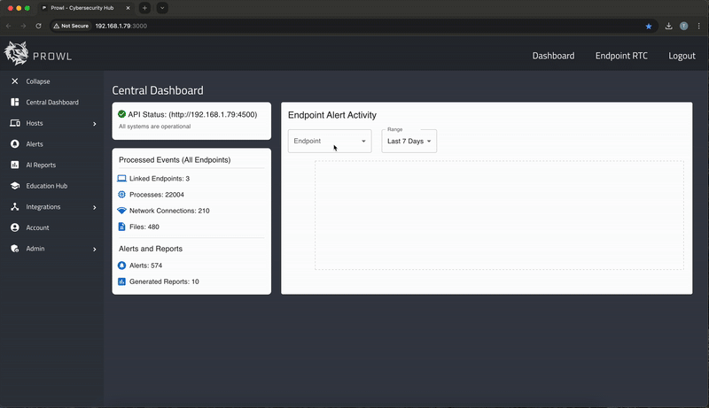

# Prowl: Cybersecurity Hub

A lightweight and seamless solution for monitoring endpoint security and cybersecurity related events for SMEs (Small & Medium Enterprises). 



## Glossary 

Throughout this README, multiple terms related to cybersecurity are used, so this glossary provides a brief description of each term to solve any confusion. 

- **Endpoint**: Any device that connects to a network to share data. For this project, an endpoint refers to any device (e.g laptop, PC) that is linked to Prowl and sends frequent device data.
  
- **Telemetry**: Data that is automatically sent from a device to the API for remote monitoring and analysis.
  
- **Agents**: Scripts that are unique to each operating system (Windows, Linux, MacOS) that use OS calls and functions to collect device telemetry and send the parsed data to the API for ingestion.
  
- **Ingestion**: The process of filtering and handling different telemetry types (e.g process data, filesystem data, network data) and to also conduct security analysis and database operations. 

## Structure

Prowl is split between three key components that consolidate the entire system. The solution is designed to be **cross-platform** meaning that the frontend and backend can run on different devices on different operating systems, giving users the choice on how to operate the solution alongside providing a consistent and uniform user experience. 

Prowl is designed to run **locally** but the solution can be deployed in the cloud if the necessary environment variables are updated. 

A brief summary on each component is listed below: 

`/frontend`: A ReactJS application that renders data returned from the Prowl API in a user friendly and intuitive manner. 

`/backend`: The API that powers Prowl's security detection and other server functionalities such as user sessions, telemetry collection from endpoints and oauth (Open Authentication) with Github for repo security analysis.  

`/scripts`: Agents that collect device data ("telemetry") for security analysis by automatically sending process, filesystem and network data to the API. 

## System Requirements 

It is recommended to run the **backend server** on a system with sufficient RAM to not bottleneck the frequent data being sent from multiple endpoints and ensure that the server is able to analyse security threats and send alerts in a timely manner. Any system with **6GB RAM+** will be more than sufficient to operate the server and perform other tasks on the system as normal. 

Due to numerous libraries and tools being used to create Prowl, some additional frameworks and packages will need to be installed on the system to ensure that Prowl functions correctly. 

These packages are listed below: 

<table>
  <thead>
    <tr>
      <th>Package</th>
      <th>Function</th>
      <th>Link</th>
    </tr>
  </thead>
  <tbody>
    <tr>
      <td>NodeJS (v22+)</td>
      <td>Used as the runtime environment for the backend and frontend.</td>
      <td><a href="https://nodejs.org/en/download"/>NodeJS Download</td>
    </tr>
    <tr>
      <td>MongoDB</td>
      <td>Used as the NoSQL database for the backend server.</td>
      <td><a href="https://www.mongodb.com/docs/manual/installation"/>MongoDB Download</td>
    </tr>
    <tr>
      <td>Python (3.10+)</td>
      <td>Used for network data collection across all agent scripts.</td>
      <td><a href="https://www.python.org/downloads"/>Python Download</td>
    </tr>
    <tr>
      <td>JQ</td>
      <td>Used for parsing telemetry data into JSON across all agent scripts.</td>
      <td><a href="https://jqlang.org/download"/>JQ Download</td>
    </tr>
    <tr>
      <td>Gitleaks</td>
      <td>Used for analysing github repos for sensitive information exposure.</td>
      <td><a href="https://github.com/gitleaks/gitleaks"/>Gitleaks Download</td>
    </tr>
  </tbody>
</table>

Additionally, on **Windows systems** ensure that **git** is installed and **git bash** is available. This is needed to run the Windows Agent script as it uses a hybrid of bash and powershell commands. 


## Installation and Setup

### Backend Environment Variables Setup

After the repository is cloned and further steps can be followed below, a `.env` file needs to be created at the root of the `/prowl/backend` directory so that important variables can be changed when necessary
and kept secure. 

A template for the `.env` file is shown below:

```bash
PROWL_BACKEND_PORT=4500 # example port for the server to run on 

# add different databases when needed depending on your MongoDB installation 
MONGO_URI_DEV="mongodb://localhost:27017/prowl_dev"
MONGO_URI_PROD="mongodb://localhost:27017/prowl_prod"
MONGO_URI_PROTO="mongodb://localhost:27017/prowl_prototype"

# Generate unique strings for the SECRET for JWT Authentication
JWT_SECRET=""
JWT_EXPIRY="1d"
JWT_REFRESH_SECRET=""
JWT_REFRESH_EXPIRY="7d"

PROWL_ALERTS_GMAIL_APP_PASSWORD="" # add your Gmail Account App password for email alerts
PROWL_ALERTS_DISCORD_WEBHOOK_URL="https://discord.com/api/webhooks/..." # add your discord webhook URL for discord alerts 

GOOGLE_AI_API_KEY="" # add your Google API Key to access Gemini Services for dynamic threat analysis 
VIRUSTOTAL_API_KEY="" # add your VirusTotal API Key for file integrity checks 

# Add your Github OAuth Client ID and Client Secret to access Github Repos for analysis 
GITHUB_CLIENT_ID="" 
GITHUB_CLIENT_SECRET=""

PROWL_GITHUB_CLONE_PATH="./security-analysis/repos/"  # add your desired file path for cloning and analysing repos when connected to Github

PROWL_FRONTEND_HUB="http://192.168.1.79:3000" # add your ReactJS URL so that redirects and URLs in alerts are able to go back to the frontend 
```

### Steps

1. Clone the repository via:
   ```bash
   git clone https://github.com/Tamandeep-Singh/prowl.git
   ```
  
2. Install Frontend Dependencies:
   ```bash
   cd /prowl/frontend
   npm install
   ```

3. Install Backend Dependenices:
   ``` bash
   cd /prowl/backend
   npm install
   ```

4. Run the Backend Server (port will be displayed once run):

   ```bash
   cd /prowl/backend
   node app.js
   ```

5. Get your system's LAN IP:

   On Windows:
   ```bash
   ipconfig.exe | grep "IPv4 Address:"
   ```

   On MacOS and Linux:
   ```bash
   ifconfig | grep "inet "
   ```

6. Modify `/frontend/services/api_service.js` to have the backend's IP address and PORT:

   ```JavaScript
   static endpoint = "http://<YOUR LAN IP>:<SERVER PORT>";
   ```

7. Modify every agent script in `/prowl/scripts` to have the backend's IP address and PORT:

   ```bash
   PROWL_API_ENDPOINT="http://<YOUR LAN IP>:<SERVER PORT>/api/endpoints/"
   ```
   
8. Change the React App's ```package.json``` to the target system's LAN IP: 

   ```JSON
    "start": "HOST=<YOUR LAN IP> react-scripts start"
   ```

9. Run the Frontend:

   ```bash
   npm run start
   ```

Congratulations! Prowl should now be active and running where you will be redirected to ```http://<YOUR LAN IP>:3000/login``` where you can login or signup and access the main dashboard. 

## Employing the Agent Scripts

For whatever agent you decide to employ based on your operating system, there are two functionalities for each script. To link an endpoint, use the `link-endpoint` command:

```bash
cd /prowl/scripts
./macos-agent.sh link-endpoint
```

If the endpoint is successfully or already linked, run the agent script again without the `link-endpoint` argument to start telemetry collection. 

**Note**: Ensure the script is able to be executed with correct file permissions (e.g via `chmod +x`). Additional setup may be required such as `full disk access for the terminal` running the script or modifying `sudoers` to run the network.py script due to additional permissions being necessary. 

## Using Prowl

The agent scripts are designed to be run continously on specific "tuning delays" in order to buffer the amount of telemetry being sent (in conjunction to the backend also maintaining a buffer to not constantly insert duplicate telemetry data and analyse the same events repeatedly). These tuning variables can be adjusted in the scripts as needed (the benefits of an open-source solution). 

The scripts can also be run as needed in the terminal or be modified to run as services so that the endpoint is monitored on each boot up. 

The frontend exposes a rich and friendly user-interface with numerous page guides for each component, alongside interactive elements such as filtering events for different values (e.g find all processes that were running on the target endpoint on a specific date) alongside the ability to analyse each alert with **Google's Geminin AI for dynamic threat analysis**. 

Prowl boasts numerous functionalities and aims to provide the best cybersecurity experience for SMEs who want a free, open-source, automated threat management system. 

Prowl is able to:

- Collect live telemetry data from all major operating systems (Windows, Linux, MacOS) with dedicated agents
- Filter for every process, filesystem or network event by multiple fields (e.g date, name, endpoint, etc)
- Connect to every linked endpoint via SSH to run commands directly from the frontend
- Integrate with Github OAuth to access the user's repos and analyse them for any security issues (e.g sensitive information exposure)
- Automatically score telemetry events with custom rules and send alerts via Gmail / Discord for critical threats
- Integrate with OSINT (Open Source Intelligence) tools like VirusTotal to strengthen the evidence for a potential alert

***

**Prowl: Cybersecurity Hub is a QMUL (ECS635U) Final Year Project**. 
   


